# Dokumentasi Visual Absensi-App

Dokumen ini berisi diagram arsitektur sistem dan ERD database yang lengkap untuk proyek Absensi-App.

## 1. Master Diagram (Arsitektur & Alur Program)

Diagram ini menunjukkan bagaimana Client (Web & Mobile) berinteraksi dengan Server dan Database.

```mermaid
flowchart TB
    %% Client Side
    subgraph Client_Layer ["1. Client Side (User Interface)"]
        direction LR
        Web["💻 Admin Panel (React.js/MUI)\n- Kelola Pegawai\n- Monitor Absensi\n- Pengaturan Sistem"]
        
        Mobile["📱 Aplikasi Mobile (Flutter)\n- Scan Wajah\n- Validasi GPS\n- Riwayat Absen"]
    end

    %% Server Side
    subgraph Server_Layer ["2. Server Side (Node.js API)"]
        direction TB
        API["🚀 Express API\n(Routes & Logic)"]
        
        Auth["🔐 JWT Middleware\n(Keamanan)"]
        
        FaceEngine["🧠 Face-api.js\n(Biometric Engine)"]
    end

    %% Database & Storage
    subgraph Database_Layer ["3. Database & Storage (MySQL)"]
        direction TB
        
        subgraph ERD ["Skema Database (ERD)"]
            T1[("👤 admin_users\n(Login Admin)")]
            T2[("👥 employees\n(Data Pegawai)")]
            T3[("👁️ employee_faces\n(Data Wajah)")]
            T4[("📝 attendance\n(Log Absensi)")]
            T5[("⚙️ system_settings\n(Config Jam/Akurasi)")]
            T6[("📅 holidays\n(Hari Libur)")]
            
            %% Relationships
            T2 -- 1:N --- T3
            T2 -- 1:N --- T4
        end
        
        Files[("📂 File Storage\n(/uploads/attendance\n/uploads/profiles)")]
    end

    %% Interaction Flows
    Web <--> Auth
    Mobile <--> API
    API <--> Auth
    API <--> FaceEngine
    API <--> T1
    API <--> T2
    API <--> T5
    API <--> T6
    FaceEngine <--> T3
    API -- "Simpan Log" --> T4
    API -- "Simpan Foto" --> Files
```

---

## 2. Entity Relationship Diagram (ERD) Detail

Struktur tabel lengkap beserta tipe data dan relasinya.

---

## 3. Alur Deteksi Wajah (Sequence Diagram)

